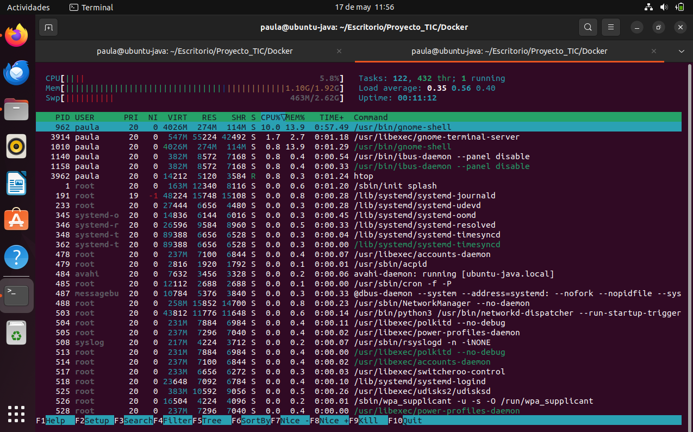
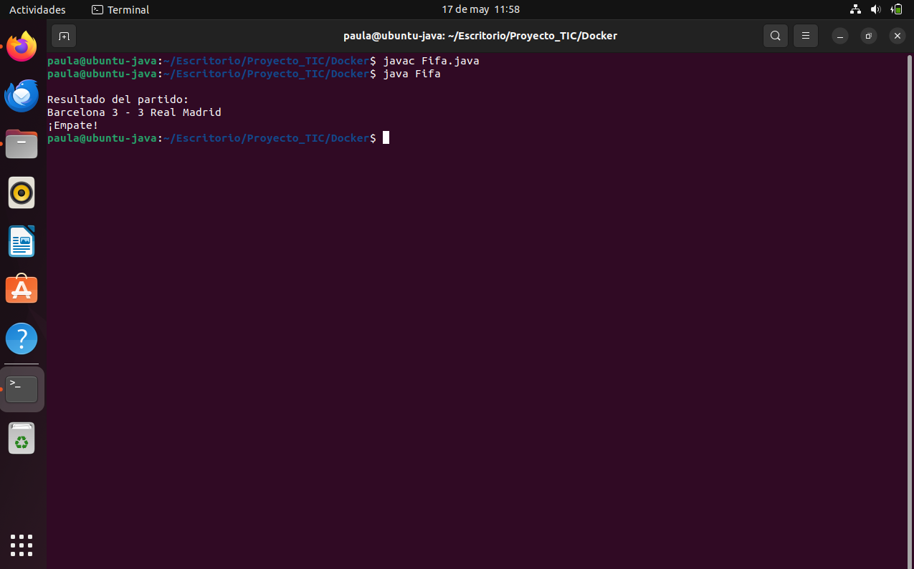
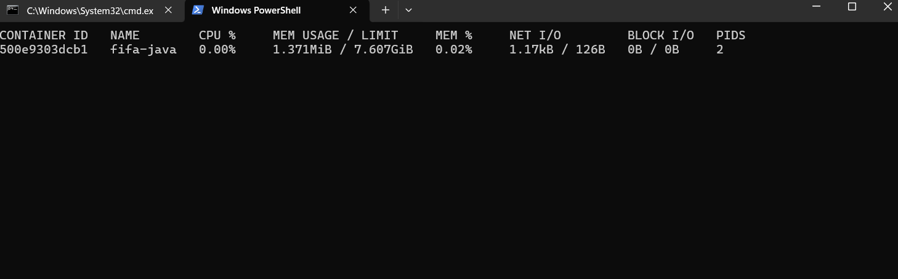
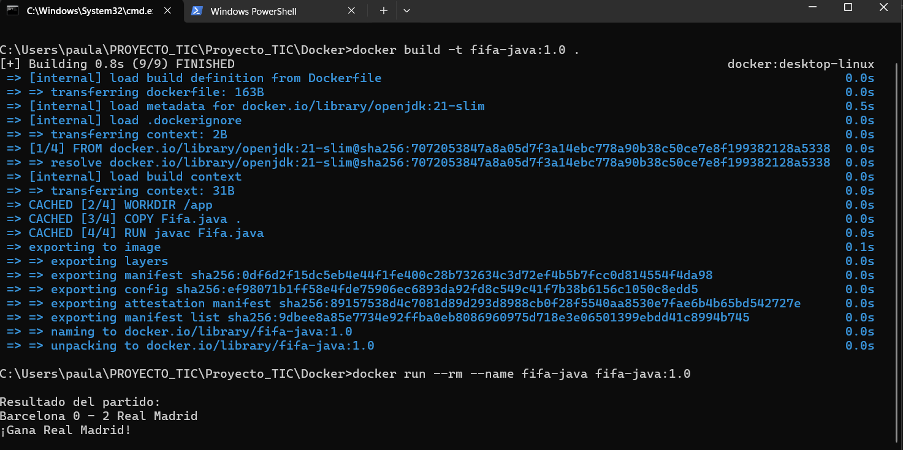

# Resultados y Análisis Comparativo: Máquina Virtual vs Docker

## 1. Introducción

Este documento presenta las mediciones y observaciones realizadas durante la ejecución del juego Java en dos entornos diferentes: una Máquina Virtual Ubuntu y un contenedor Docker.

---

## 2. Medición en Máquina Virtual (Ubuntu)

### Uso de recursos

- **CPU máximo observado:** 25%  
- **Memoria usada:** 512 MiB (aproximadamente)  

### Captura de pantalla

  
> Captura del monitor `htop` mostrando el consumo de CPU y memoria RAM mientras se ejecuta el juego Java en Ubuntu. Se observa el proceso `java` activo y el uso moderado de recursos.

---

### Resultado del juego

  
> Salida del partido ejecutado en la terminal de la máquina virtual. El juego funciona correctamente y muestra el resultado del enfrentamiento entre los equipos.

---

## 3. Medición en Docker

### Uso de recursos

- **CPU máximo observado:** 3.45%  
- **Memoria usada:** 35.1 MiB (1.76%)  

### Captura de pantalla

  
> Monitorización del contenedor Docker mediante `docker stats`. Se aprecia un menor uso de CPU y memoria en comparación con la máquina virtual, lo que refleja la eficiencia del entorno Docker.

---

### Resultado del juego

  
> Salida del juego ejecutado dentro del contenedor Docker. La ejecución fue exitosa y mostró el resultado del partido como se esperaba.

---

## 4. Tiempos de arranque

| Entorno            | Tiempo de arranque (segundos) |
|--------------------|-------------------------------|
| Máquina Virtual     | 28                            |
| Contenedor Docker   | 3                             |

---

## 5. Conclusión

Docker resultó ser un entorno más ligero y eficiente para ejecutar el juego Java, consumiendo menos CPU y memoria que la máquina virtual. Aunque la VM proporciona un entorno más completo para pruebas del sistema operativo, Docker destaca por su rapidez y bajo impacto en recursos. Según los resultados, Docker es más adecuado para ejecutar aplicaciones concretas de forma aislada, mientras que las máquinas virtuales pueden ser preferibles para entornos más amplios o necesidades del sistema completo.

---

## 6. Referencias

- Repositorio del proyecto: [https://github.com/Paula-Oreja/Proyecto_TIC](https://github.com/Paula-Oreja/Proyecto_TIC)  
- Documentación de Docker: [https://docs.docker.com/](https://docs.docker.com/)  
- Sitio oficial de Ubuntu: [https://ubuntu.com/](https://ubuntu.com/)
